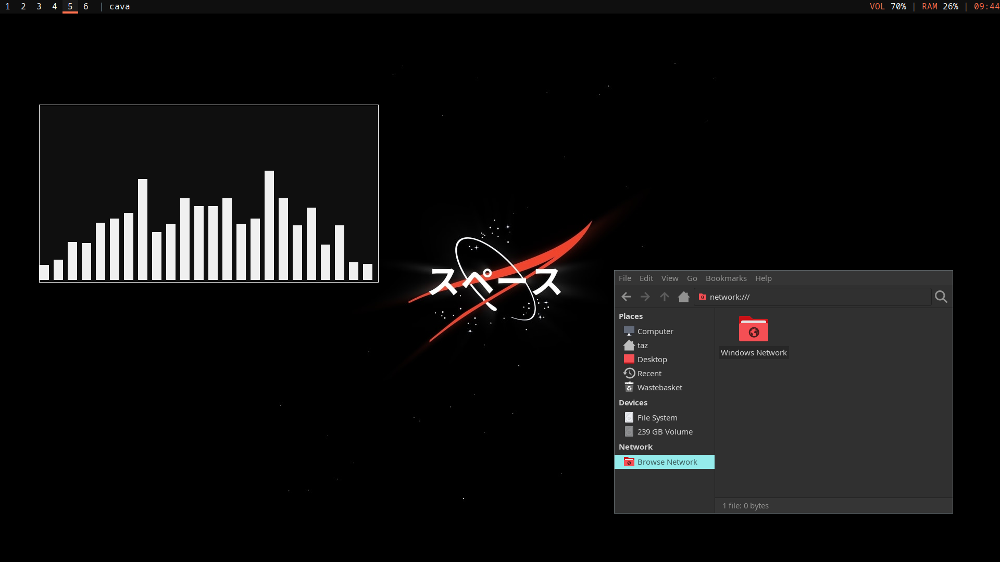

# __**TARDIS**__ - the post-install script for chads

## What is TARDIS?

TARDIS is a post-install script for Arch Linux developed by [me](https://notnapoleon.net). It is inspired by Derek Taylor's [dtOS](https://gitlab.com/dtos/dtos) and Luke Smith's [larbs](https://larbs.xyz) utilities.

## Default Tools

Here are the tools that come preinstalled with TARDIS:

- i3 (window manager)
- polybar (status bar)
- librewolf (web browser)
- thunar (file manager)
- alacritty (terminal)
- vim & leafpad (text editors - one text-based, one terminal-based)
- gvfs-smb (to connect to samba file shares)
- zsh (shell)
- sddm (login screen)

## Screenshot

## Questions

####  Is TARDIS a Linux Distro or a desktop environment?

Neither, but you could argue it's like a desktop environment because it installs the tools associated with a desktop environment (file manager, image viewer, panel etc).

#### Can I modify TARDIS?

Absolutely, TARDIS is free software meaning the source code is publicly available and you're allowed to modify/redistribute it for your own needs. However, I'd appreciate it if you clarify that your work is a derivative.

#### Why are you using (x) instead of (y)?

It's worth clarifying that I'm not a programmer, so I'm aware my code isn't very efficient.

As for why I chose a certain piece of software over another? Well it's purely down to my preference.
